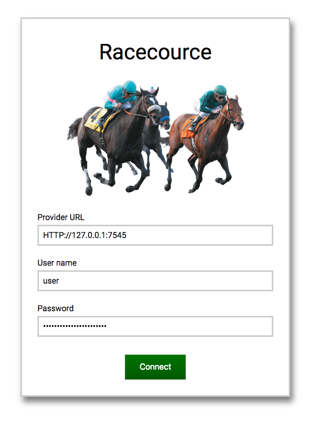
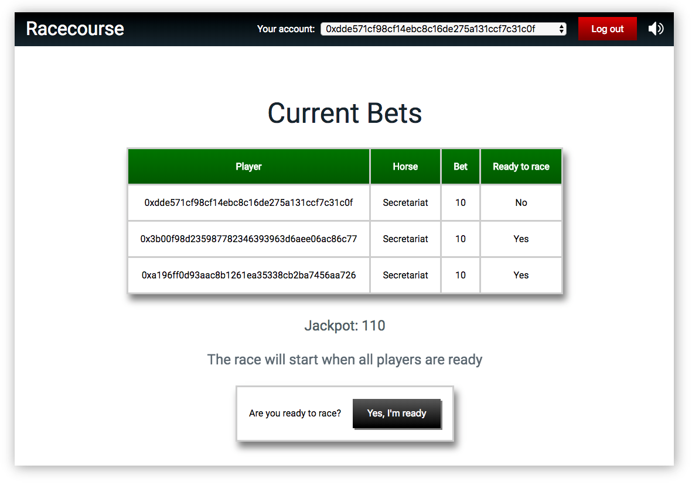
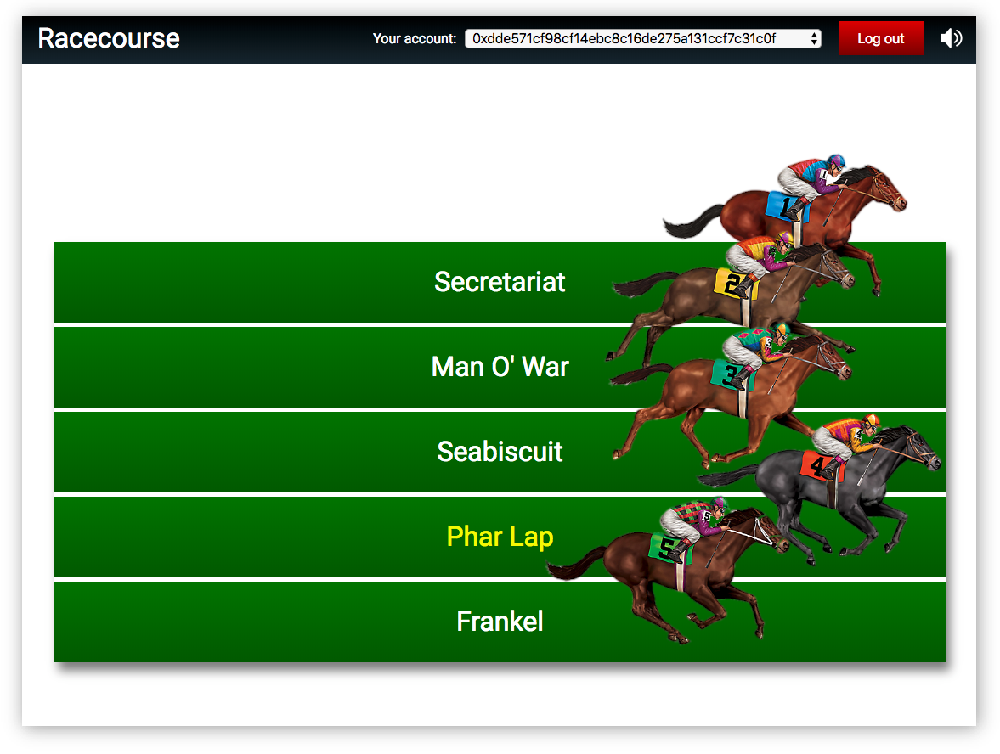

# Racecourse

<p align="center">
    
</p>

Horse racing game implemented as decentralized application.

The front end is built using [React](https://reactjs.org) and [Redux](https://redux.js.org). The back-end is built on [NodeJS](https://nodejs.org/) and utilizes [MongoDB](https://www.mongodb.com/) to store user preferences (enabling / disabling sounds in the application). Communication between the front-end and the back-end is carried out using [Socket.io](https://socket.io/). The game itself is implemented as a smart contract written in [Solidity](http://solidity.readthedocs.io).

### Environment setup:

 1. Make sure you have NodeJS installed. Also, MongoDB must be running on mongodb://localhost:27017.

 2. Setup configuration files.

    - Open blockchain/truffle.sh and set the "knode" provider information.
    - Open server/settings.json and set the url, username and apikey for the provider.

 3. Deploy the smart contract.
    ```
    cd blockchain
    ./truffle-migrate.sh
    ```

 4. Download dependencies and start the server.
    ```
    cd ..
    cd server
    npm install
    node server.js
    ```
 5. download dependencies and build the client.
    ```
    cd ..
    cd client
    npm install
    npm run build
    ```
 6. Open http://localhost:3001

### Game rules

 - Players must place bets by selecting a race horse and an amount of tokens.
 - No more than one bet per player is allowed in each race.
 - Once the bet is placed, players get to choose when they are ready to race.
 - Players may choose to race immediately or wait for others to join.
 - When all players are ready, the race takes place and the winning race horse is announced.
 - If one or more players had bet for the winning race horse, the jackpot will be distributed equally among them.
 - If there are no winners, the jackpot is carried over to the next race.


---

### Screen shots

<p align="center">
    
</p>

<p align="center">
    
</p>

<p align="center">
    
</p>
